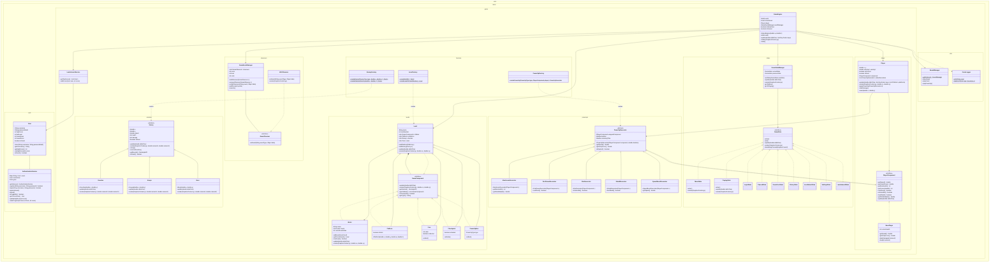

# Complete Class Diagram

This diagram represents the entire structure of the Super Mario project, including all packages, classes, attributes, methods, and their relationships.

```mermaid
classDiagram

%% ===================== AUTH =====================
namespace com.mario.auth {
    class User {
        -String username
        -String passwordHash
        -int highScore
        -int lastLevel
        -int savedLives
        -int savedScore
        -boolean isGuest
        +User(String username, String passwordHash)
        +getUsername() String
        +getHighScore() int
        +setHighScore(int score)
        +isGuest() boolean
    }

    class AuthenticationService {
        -Map~String, User~ users
        -User currentUser
        -Gson gson
        +getInstance() AuthenticationService
        +register(String username, String password) boolean
        +login(String username, String password) boolean
        +loginAsGuest()
        +logout()
        +isLoggedIn() boolean
        +getCurrentUser() User
        +updateHighScore(int score)
        +saveProgress(int level, int lives, int score)
    }
}

User -- AuthenticationService


%% ===================== ENEMIES =====================
namespace com.mario.game.enemies {
    class Enemy {
        <<abstract>>
        #double x
        #double y
        #double speed
        #int health
        #int damage
        #boolean isDead
        +update(double deltaTime)*
        +render(GraphicsContext gc, double cameraX, double cameraY)*
        +stomp()
        +reverseDirection()
        +getBounds() Rectangle2D
        +isDead() boolean
    }

    class Goomba {
        +Goomba(double x, double y)
        +update(double deltaTime)
        +render(GraphicsContext gc, double cameraX, double cameraY)
    }

    class Koopa {
        +Koopa(double x, double y)
        +update(double deltaTime)
        +render(GraphicsContext gc, double cameraX, double cameraY)
    }

    class Boss {
        +Boss(double x, double y)
        +update(double deltaTime)
        +render(GraphicsContext gc, double cameraX, double cameraY)
    }
}

Enemy <|-- Goomba
Enemy <|-- Koopa
Enemy <|-- Boss


%% ===================== FACTORIES =====================
namespace com.mario.game.factories {
    class EnemyFactory {
        +createEnemy(EnemyType type, double x, double y) Enemy$
        +createRandomEnemy(double x, double y) Enemy$
    }

    class LevelFactory {
        +createWorld1() World$
        +createLevel(int levelNumber) Level$
    }

    class PowerUpFactory {
        +createPowerUp(PowerUpType type, PlayerComponent player) PowerUpDecorator$
    }
}

EnemyFactory ..> Enemy : creates
LevelFactory ..> Level : creates
PowerUpFactory ..> PowerUpDecorator : creates


%% ===================== LEVELS =====================
namespace com.mario.game.levels {
    class GameComponent {
        <<interface>>
        +update(double deltaTime)
        +render(GraphicsContext gc, double cx, double cy)
        +getBounds() Rectangle2D
        +getChildren() List~GameComponent~
        +isComposite() boolean
        +getType() String
    }

    class Level {
        -String name
        -int levelNumber
        -List~GameComponent~ children
        -List~Platform~ platforms
        -List~Enemy~ enemies
        -List~Coin~ coins
        +addPlatform(Platform p)
        +addEnemy(Enemy e)
        +update(double deltaTime)
        +render(GraphicsContext gc, double cx, double cy)
    }

    class World {
        -String name
        -List~Level~ levels
        -int currentLevelIndex
        +addLevel(Level level)
        +getCurrentLevel() Level
        +nextLevel() boolean
        +update(double deltaTime)
        +render(GraphicsContext gc, double cx, double cy)
    }

    class Platform {
        -boolean isSolid
        +Platform(double x, double y, double w, double h)
    }

    class Coin {
        -int value
        -boolean collected
        +collect()
    }
    
    class Checkpoint {
        -boolean activated
        +activate()
    }

    class PowerUpItem {
        -PowerUpType type
        +collect()
    }
}

GameComponent <|.. Level
GameComponent <|.. World
GameComponent <|.. Platform
GameComponent <|.. Coin
GameComponent <|.. Checkpoint
GameComponent <|.. PowerUpItem

Level --> World
Level o-- Platform
Level o-- Coin
Level o-- Checkpoint
Level o-- PowerUpItem
Level *-- GameComponent


%% ===================== OBSERVERS =====================
namespace com.mario.game.observers {
    class GameObserver {
        <<interface>>
        +onEvent(String eventType, Object data)
    }

    class GameEventManager {
        -List~GameObserver~ observers
        -int score
        -int lives
        -int coins
        +addObserver(GameObserver o)
        +removeObserver(GameObserver o)
        +notifyObservers(String event, Object data)
        +addScore(int points)
        +loseLife()
    }

    class HUDObserver {
        +onEvent(String eventType, Object data)
        +render(GraphicsContext gc)
    }
}

GameEventManager o-- GameObserver
HUDObserver ..|> GameObserver


%% ===================== PLAYER =====================
namespace com.mario.game.player {
    class PlayerComponent {
        <<interface>>
        +getSpeed() double
        +getJumpForce() double
        +getMaxHealth() int
        +getCurrentHealth() int
        +canShoot() boolean
        +isInvincible() boolean
        +hasShield() boolean
        +getSizeMultiplier() double
        +update(double deltaTime)
    }

    class BasePlayer {
        -int currentHealth
        +getSpeed() double
        +getJumpForce() double
        +takeDamage(int amount)
        +heal(int amount)
    }

    class Player {
        -double x, y
        -double velocityX, velocityY
        -boolean onGround
        -boolean isDead
        -PlayerComponent component
        -List~PowerUpDecorator~ activeDecorators
        +update(double deltaTime, Set~KeyCode~ keys, List~Platform~ platforms)
        +render(GraphicsContext gc, double cx, double cy)
        +applyPowerUp(PowerUpDecorator d)
        +takeDamage()
        +reset(double x, double y)
    }
}

PlayerComponent <|.. BasePlayer
Player --> PlayerComponent
Player --> PowerUpDecorator


%% ===================== POWER UPS =====================
namespace com.mario.game.powerups {
    class PowerUpDecorator {
        <<abstract>>
        #PlayerComponent wrappedComponent
        #double duration
        #double remainingTime
        +PowerUpDecorator(PlayerComponent component, double duration)
        +getSpeed() double
        +getJumpForce() double
        +isExpired() boolean
    }

    class MushroomDecorator {
        +MushroomDecorator(PlayerComponent c)
        +getMaxHealth() int
        +getSizeMultiplier() double
    }

    class FireFlowerDecorator {
        +FireFlowerDecorator(PlayerComponent c)
        +canShoot() boolean
    }
    
    class StarDecorator {
        +StarDecorator(PlayerComponent c)
        +isInvincible() boolean
    }
    
    class ShieldDecorator {
         +ShieldDecorator(PlayerComponent c)
         +hasShield() boolean
    }
    
    class SpeedBoostDecorator {
        +SpeedBoostDecorator(PlayerComponent c)
        +getSpeed() double
    }
}

PlayerComponent <|.. PowerUpDecorator
PowerUpDecorator o-- PlayerComponent
PowerUpDecorator <|-- MushroomDecorator
PowerUpDecorator <|-- FireFlowerDecorator
PowerUpDecorator <|-- StarDecorator
PowerUpDecorator <|-- ShieldDecorator
PowerUpDecorator <|-- SpeedBoostDecorator


%% ===================== STATES =====================
namespace com.mario.game.states {
    class GameState {
        <<interface>>
        +enter()
        +exit()
        +update(double deltaTime)
        +render(GraphicsContext gc)
        +handleKeyPressed(KeyEvent event)
    }

    class GameStateManager {
        -GameState currentState
        -GameState previousState
        +setState(GameState newState)
        +update(double deltaTime)
        +render(GraphicsContext gc)
        +goToMenu()
        +goToPlaying()
    }

    class MenuState {
        +enter()
        +render(GraphicsContext gc)
    }

    class PlayingState {
        +enter()
        +update(double deltaTime)
        +render(GraphicsContext gc)
    }
    
    class LoginState
    class PausedState
    class GameOverState
    class VictoryState
    class LevelSelectState
    class SettingsState
    class LeaderboardState
}

GameStateManager --> GameState
GameState <|.. MenuState
GameState <|.. PlayingState
GameState <|.. LoginState
GameState <|.. PausedState
GameState <|.. GameOverState
GameState <|.. VictoryState
GameState <|.. LevelSelectState
GameState <|.. SettingsState
GameState <|.. LeaderboardState


%% ===================== CORE GAME =====================
namespace com.mario.game {
    class GameEngine {
        -World world
        -Level currentLevel
        -Player player
        -GameEventManager eventManager
        -boolean isGameOver
        -boolean isPaused
        +GameEngine(double w, double h)
        +startLevel()
        +update(double deltaTime, Set~KeyCode~ keys)
        +render(GraphicsContext gc)
        +reset()
    }

    class LeaderboardService {
        +getTopScores() List~User~
        +addScore(User user, int score)
    }
}

GameEngine --> GameStateManager
GameEngine --> LeaderboardService
GameEngine --> GameEventManager
GameEngine --> Player
GameEngine --> Level

LeaderboardService --> User


%% ===================== UTILS =====================
namespace com.mario.utils {
    class GameLogger {
        +info(String msg)$
        +logError(String msg, Exception e)$
    }

    class SoundManager {
        +getInstance() SoundManager$
        +playJump()
        +playCoin()
        +playPowerUp()
    }
}

GameEngine --> SoundManager
GameEngine ..> GameLogger
```
